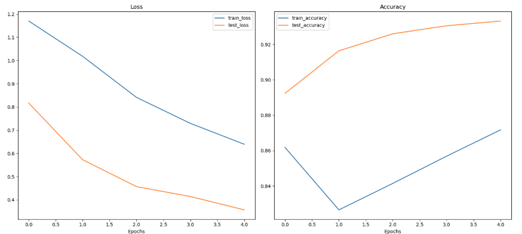

# 🌸 Deep Learning Flower Classification


A deep learning application that classifies 102 different flower species using transfer learning with EfficientNet-B0 architecture. This project demonstrates image classification using PyTorch, with a command-line interface for both training and prediction.


## The training pipeline consists of five main stages:

1. **Initialization**
   - Parse command line arguments
   - Set up GPU/CPU device
   - Initialize training parameters

2. **Data Pipeline**
   - Load and organize flower dataset
   - Apply image transformations:
     * Random rotation (30°)
     * Random resizing and cropping (224x224)
     * Random horizontal flipping
     * Normalization
   - Create data loaders for training and validation

3. **Model Setup**
   - Load pre-trained EfficientNet-B0
   - Freeze feature extraction layers
   - Modify classifier for 102 flower classes
   - Move the model to the appropriate device

4. **Training Loop**
   - Forward pass: compute predictions
   - Calculate loss using CrossEntropyLoss
   - Backward pass: compute gradients
   - Update weights using Adam optimizer
   - Validate on a test set
   - Track metrics (loss and accuracy)

5. **Model Saving**
   - Save model checkpoints
   - Store class mappings
   - Save training metrics

NB: The model is only 17.9 MB on disk

## The prediction pipeline follows these steps:

1. **Image Processing**
   - Load input image
   - Resize to 256 px on the shortest side
   - Center crop to 224x224
   - Convert to tensor
   - Normalize using ImageNet stats

2. **Model Loading**
   - Load saved checkpoint
   - Restore model architecture
   - Load trained weights
   - Set model to evaluation mode

3. **Inference**
   - Pass processed image through a model
   - Apply softmax to get probabilities
   - Get top-k predictions
   - Map indices to flower names

4. **Results Visualization**
   - Display original image
   - Show top predictions
   - Plot probability distribution
   - Print flower names and confidence scores

## Example Output:

Top 5 Predictions with topK args = 5
1. stemless gentian: 0.9387
2. monkshood: 0.0407
3. balloon flower: 0.0066
4. canterbury bells: 0.0024
5. morning glory: 0.0022

## 🚀 Features

- Transfer learning using pre-trained EfficientNet-B0
- Command-line interface for training and prediction
- GPU acceleration support
- Top-k predictions with probability scores
- Data augmentation for improved training
- Interactive visualization of results

## 🛠️ Installation

1. Clone the repository
```bash
   git clone https://github.com/levisstrauss/flower_classification.git
   cd flower_classification
```
2. Create and activate virtual environment (optional but recommended)
```bash
   python -m venv venv
   source venv/bin/activate  # On Windows: venv\Scripts\activate
```
3. Install dependencies
```bash
   pip install -r requirements.txt
```
## 📊 Project Structure
```
flower-classification/
├── data/
│   └── flowers/           # Dataset directory
├── src/
│   ├── train.py          # Training script
│   ├── predict.py        # Prediction script
│   ├── model_utils.py    # Model architecture utilities
│   ├── data_utils.py     # Data loading utilities
│   ├── train_utils.py    # Training functions
│   └── utils.py          # General utilities
├── models/               # Saved model checkpoints
└── README.md
```
## 💻 Usage
###  Training
Train a new model with custom parameters:
```bash
   python train.py flowers --arch efficientnet_b0 --learning_rate 0.001 --epochs 1 --gpu --save_dir models
```
### Arguments:
- data_directory: Path to data directory (default: "flowers")
  - Must contain train, valid, and test folders
- --save_dir: Directory to save model checkpoints (default: 'checkpoints')
- --arch: Model architecture (default: 'efficientnet_b0')
  - Currently supports: ['efficientnet_b0']
- --learning_rate: Learning rate for optimizer (default: 0.001)
- --epochs: Number of training epochs (default: 5)
- --gpu: Flag to use GPU for training if available (optional)

### 📈 Model Performance

#### Loss Analysis
- Training loss (blue) decreases steadily from 1.2 to 0.65, showing good convergence
- Validation loss (orange) drops from 0.8 to 0.4, indicating no overfitting
- The gap between training and validation loss remains stable, suggesting good generalization

#### Accuracy Analysis
- Validation accuracy (orange) shows strong improvement, reaching ~93%
- Training accuracy (blue) initially drops but recovers, reaching ~87%
- Model achieves the best validation accuracy around epoch 3.5

#### Key Observations
   1. **No Overfitting**: Validation metrics consistently improve
   2. **Convergence**: Loss curves show steady decrease
   3. **Stable Learning**: No erratic fluctuations in metrics
   4. **Good Generalization**: Model performs better on a validation set

## Prediction
Make predictions on new images:
```bash
   python predict.py ./flowers/test/28/image_05230.jpg models/efficientnet_b0_checkpoint.pth --category_names cat_to_name.json --gpu --top_k 5
```
### Arguments:
- input: Path to an image file (required)
- checkpoint: Path to saved model checkpoint (required)
- --top_k: Number of top predictions to return (default: 5)
- --category_names: Path to category names JSON file (default: 'cat_to_name.json')
- --gpu: Flag to use GPU for inference if available (optional)

## 📈 Model Architecture
```bash
   model.classifier = nn.Sequential(
       nn.Dropout(p=0.2, inplace=True),
       nn.Linear(in_features=1280, out_features=102, bias=True)
   )
```
## 🎯 Performance for five epochs

- Training Accuracy: 86%
- Validation Accuracy: 90.7%
- Test Accuracy: 90.23%
  - Total Correct: 739/819
  - Test loss: 0.413
    
## 📚 Dataset
The project uses the 102 Category Flower Dataset from Oxford University, consisting of 102 flower categories with each class containing between 40 and 258 images.

## 🙏 Acknowledgments

- AWS
- Udacity
- PyTorch Team
- Oxford 102 Flower Dataset
- EfficientNet Implementation
